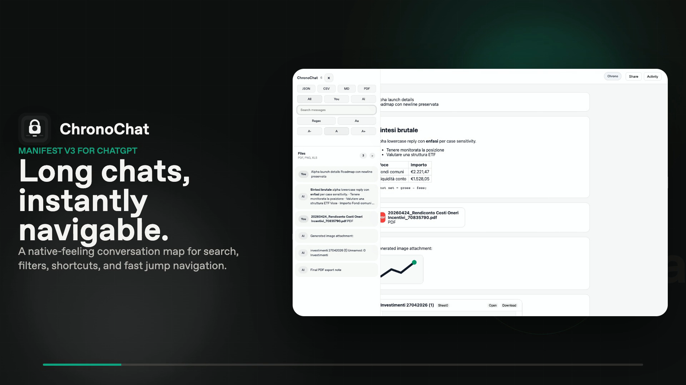

# ChronoChat

Navigate long ChatGPT conversations with clarity.




Watch the 12-second HyperFrames product promo: [chronochat-hyperframes-promo.mp4](assets/promo/chronochat-hyperframes-promo.mp4)

Additional promo stills:
[GitHub hero](assets/promo/chronochat-github-hero.png) ·
[wide social](assets/promo/chronochat-social-wide.png) ·
[square social](assets/promo/chronochat-social-square.png) ·
[story](assets/promo/chronochat-social-story.png) ·
[browser capture](assets/promo/browser-captures/chronochat-real-harness-open.png) ·
[sidebar capture](assets/promo/browser-captures/chronochat-real-sidebar.png)

ChronoChat is a Manifest V3 browser extension for ChatGPT that adds a native-feeling conversation map on the right side of the page. It helps you scan long threads, filter turns, search quickly, and jump back to the exact part of the conversation you need.

## Why ChronoChat

- Built for long ChatGPT sessions that become hard to navigate
- Designed to feel visually coherent with ChatGPT instead of competing with it
- Keeps everything local: no backend, no analytics, no remote runtime assets

## Features

- Right-side conversation map for the current chat
- Filters for `All`, `You`, and `AI`
- Text search across the current conversation
- Export Pro v1 for the full conversation as `JSON`, `CSV`, `Markdown`, `DOCX`, or `PDF`, preserving semantic message blocks (`heading`, `paragraph`, `list`, `quote`, `code`, `image`)
- Keyboard navigation:
  - `Ctrl/Cmd + J`: open or close ChronoChat
  - `/`: focus search
  - `j` / `k`: move selection
  - `Enter`: jump to the selected message
  - `Esc`: close the sidebar or clear search focus state
- Theme-aware UI with a ChatGPT-adjacent visual language

## Privacy

- No message content is sent to external services
- No tracking or analytics
- No remote fonts or third-party runtime requests

## Supported Hosts

- `https://chat.openai.com/*`
- `https://chatgpt.com/*`

## Installation

### Chrome / Chromium

1. Clone this repository
2. Install dependencies:

```bash
npm install
```

3. Build the extension:

```bash
npm run build
```

4. Open `chrome://extensions/`
5. Enable Developer Mode
6. Click `Load unpacked`
7. Select this project directory

### Firefox

ChronoChat is a Chromium MV3 extension. Firefox is not a release target, and background compatibility should be verified separately before relying on it.

## Development

Run tests:

```bash
npm test -- --runInBand
```

Run the full validation gate:

```bash
npm run validate
```

Run the browser smoke check:

```bash
npm run test:smoke
```

## Architecture

Source code lives in `src/`:

- `src/content/`: modular content-script source
- `src/service_worker.js`: background command routing
- `src/style.css`: source stylesheet

Build outputs used by the manifest:

- `content_script.js`
- `service_worker.js`
- `style.css`

The runtime stays vanilla, while the source stays modular and testable.

## Notes for Contributors

- Keep UI changes visually aligned with ChatGPT, not brand-heavy
- Prefer selector-first DOM parsing with resilient fallbacks, because ChatGPT markup can drift over time
- Inline images are exported when recoverable; otherwise ChronoChat emits a standard image placeholder in rendered outputs
- The semantic parser still falls back to heuristic text extraction for nested or non-text message content (complex widgets are a known limit)
- Keep global preferences separate from transient UI state
- Exporting the filtered subset of messages is backlog work; export v1 always emits the full conversation transcript
- Add runtime tests for behavior changes instead of source-inspection placeholders

## License

MIT
