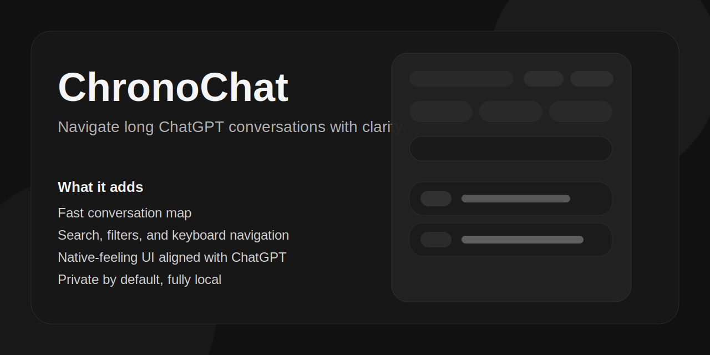

# ChronoChat

Navigate long ChatGPT conversations with clarity.



ChronoChat is a Manifest V3 browser extension for ChatGPT that adds a native-feeling conversation map on the right side of the page. It helps you scan long threads, filter turns, search quickly, and jump back to the exact part of the conversation you need.

## Why ChronoChat

- Built for long ChatGPT sessions that become hard to navigate
- Designed to feel visually coherent with ChatGPT instead of competing with it
- Keeps everything local: no backend, no analytics, no remote runtime assets

## Features

- Right-side conversation map for the current chat
- Filters for `All`, `You`, and `AI`
- Text search with optional regex and case sensitivity
- Keyboard navigation:
  - `Ctrl/Cmd + J`: open or close ChronoChat
  - `/`: focus search
  - `j` / `k`: move selection
  - `Enter`: jump to the selected message
  - `Esc`: close the sidebar or clear search focus state
- Export as `JSON`, `CSV`, or `Markdown`
- Resizable sidebar
- Theme-aware UI with a ChatGPT-adjacent visual language

## Privacy

- No message content is sent to external services
- No tracking or analytics
- No remote fonts or third-party runtime requests
- Preferences are stored locally through extension storage

## Supported Hosts

- `https://chat.openai.com/*`
- `https://chatgpt.com/*`

## Installation

### Chrome / Chromium

1. Clone this repository
2. Install dependencies:

```bash
npm install
```

3. Build the extension:

```bash
npm run build
```

4. Open `chrome://extensions/`
5. Enable Developer Mode
6. Click `Load unpacked`
7. Select this project directory

### Firefox

The project is designed primarily for Chromium MV3. Content-script behavior may work in Firefox, but background compatibility should be verified before relying on it for release.

## Development

Run tests:

```bash
npm test -- --runInBand
```

Run the full validation gate:

```bash
npm run validate
```

## Architecture

Source code lives in `src/`:

- `src/content/`: modular content-script source
- `src/service_worker.js`: background command routing
- `src/style.css`: source stylesheet

Build outputs used by the manifest:

- `content_script.js`
- `service_worker.js`
- `style.css`

The runtime stays vanilla, while the source stays modular and testable.

## Notes for Contributors

- Keep UI changes visually aligned with ChatGPT, not brand-heavy
- Prefer selector-first DOM parsing with resilient fallbacks
- Keep global preferences separate from transient UI state
- Add runtime tests for behavior changes instead of source-inspection placeholders

## License

MIT
