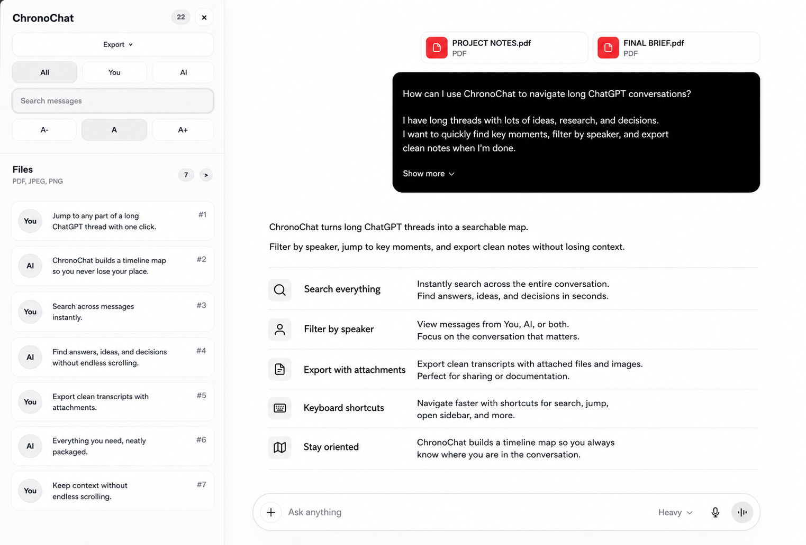

# ChronoChat

A local-first browser extension that adds a searchable conversation map to ChatGPT.

ChronoChat is built for long ChatGPT threads: research sessions, project work, debugging logs, study notes, planning chats, and any conversation where scrolling back manually becomes painful. It adds a side panel inside ChatGPT so you can scan the whole thread, filter messages, search, jump to a specific turn, and export the conversation without sending your data anywhere.




## What It Does

ChronoChat turns a long ChatGPT conversation into a navigable outline.

- See a compact list of all turns in the current chat
- Filter the list by `All`, `You`, or `AI`
- Search across the conversation and jump straight to the matching message
- Move through messages with keyboard shortcuts
- Export the full conversation as `JSON`, `CSV`, `Markdown`, `DOCX`, or `PDF`
- Keep everything local: no backend, no analytics, no remote runtime services

## Who It Is For

ChronoChat is useful when ChatGPT becomes part of your actual workflow instead of a one-off question box:

- Students reviewing long tutoring or exam-prep chats
- Developers navigating debugging sessions and code explanations
- Researchers collecting sources, arguments, and summaries
- Consultants and operators using ChatGPT for planning, writing, and analysis
- Anyone who wants a cleaner way to revisit earlier parts of a long conversation

## Product Principles

- Native-feeling: the UI is designed to sit next to ChatGPT, not fight it
- Local-first: message content stays in the browser
- Practical over flashy: fast navigation, readable previews, dependable export
- Resilient: selector-based DOM parsing with fallbacks for ChatGPT markup changes

## Features

### Conversation Map

ChronoChat adds a right-side panel with a compact preview of every detected message in the current ChatGPT thread. Each item can be clicked to jump back to that exact part of the conversation.

### Search and Filters

Use the search box to find a word or phrase inside the current conversation. Filters let you narrow the map to your messages, assistant messages, or the full thread.

### Keyboard Navigation

- `Ctrl/Cmd + J`: open or close ChronoChat
- `/`: focus search
- `j` / `k`: move selection
- `Enter`: jump to the selected message
- `Esc`: close the sidebar or clear search focus state

### Export

Export Pro v1 saves the full conversation as `JSON`, `CSV`, `Markdown`, `DOCX`, or `PDF`. The exporter preserves semantic message blocks where possible, including headings, paragraphs, lists, quotes, code, and images.

### Attachments and Media

ChronoChat detects attachment-only messages and recoverable inline images so the conversation map and export do not collapse when a turn contains files instead of plain text.

## Privacy

- No backend server
- No tracking or analytics
- No remote fonts or third-party runtime requests
- No message content is sent to external services by ChronoChat

## Supported Hosts

- `https://chat.openai.com/*`
- `https://chatgpt.com/*`

## Installation

### Chrome / Chromium

#### From a Release Zip

1. Download the latest `chronochat-extension.zip` from the GitHub Releases page
2. Extract the zip
3. Open `chrome://extensions/`
4. Enable Developer Mode
5. Click `Load unpacked`
6. Select the extracted extension folder

#### From Source

1. Clone this repository
2. Install dependencies:

```bash
npm install
```

3. Build the extension:

```bash
npm run build
```

4. Open `chrome://extensions/`
5. Enable Developer Mode
6. Click `Load unpacked`
7. Select this project directory

To create a distributable extension zip from source:

```bash
npm run package:extension
```

The package is written to `packages/chronochat-extension.zip`.

### Firefox

ChronoChat is a Chromium MV3 extension. Firefox is not a release target, and background compatibility should be verified separately before relying on it.

## Development

Run tests:

```bash
npm test -- --runInBand
```

Run the full validation gate:

```bash
npm run validate
```

Run the browser smoke check:

```bash
npm run test:smoke
```

## Architecture

Source code lives in `src/`:

- `src/content/`: modular content-script source
- `src/service_worker.js`: background command routing
- `src/style.css`: source stylesheet

Build outputs used by the manifest:

- `content_script.js`
- `service_worker.js`
- `style.css`

The runtime stays vanilla, while the source stays modular and testable.

## Notes for Contributors

- Keep UI changes visually aligned with ChatGPT, not brand-heavy
- Prefer selector-first DOM parsing with resilient fallbacks, because ChatGPT markup can drift over time
- Inline images are exported when recoverable; otherwise ChronoChat emits a standard image placeholder in rendered outputs
- The semantic parser still falls back to heuristic text extraction for nested or non-text message content (complex widgets are a known limit)
- Keep global preferences separate from transient UI state
- Exporting the filtered subset of messages is backlog work; export v1 always emits the full conversation transcript
- Add runtime tests for behavior changes instead of source-inspection placeholders

## License

MIT
